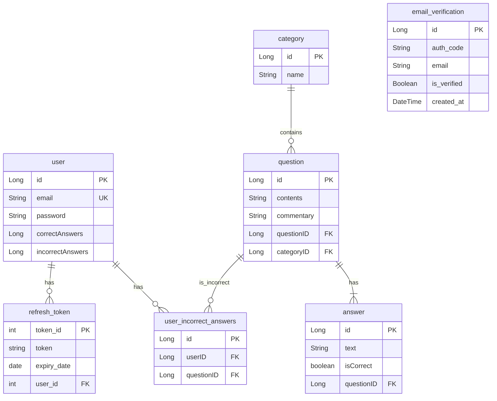

# Qint_backend

```mermaid
erDiagram
    user {
        Long id PK
        String email UK
        String password
        Long correctAnswers
        Long incorrectAnswers
    }

    category {
        Long id PK
        String name
    }

    question {
        Long id PK
        String contents
        String commentary
        Long questionID FK
        Long categoryID FK
    }
    
    answer {
        Long id PK
        String text
        boolean isCorrect
        Long questionID FK
    }

    user_incorrect_answers {
        Long id PK
        Long userID FK
        Long questionID FK
    }

    email_verification {
        Long id PK
        String auth_code
        String email
        Boolean is_verified
        DateTime created_at
    }

    refresh_token {
        int token_id PK
        string token
        date expiry_date
        int user_id FK
    }

    user ||--o{ user_incorrect_answers : has
    user ||--o{ refresh_token : has
    category ||--o{ question : contains
    question ||--|{ answer : has
    question ||--o{ user_incorrect_answers : is_incorrect
```