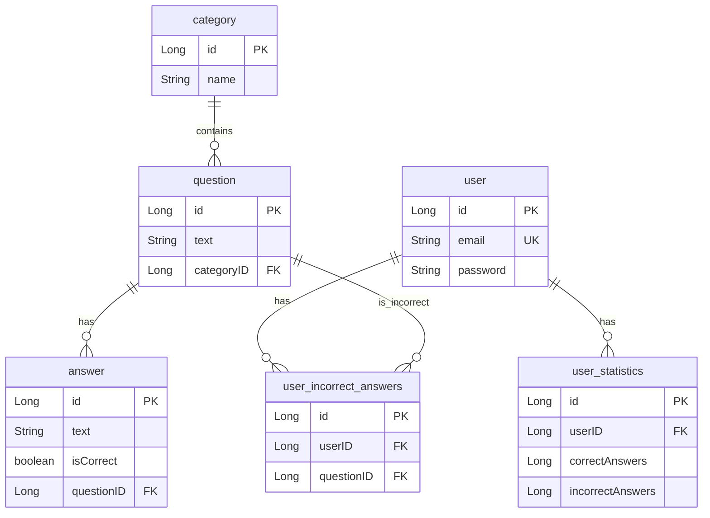

# Qint_backend

```mermaid
erDiagram
    user {
        Long id PK
        String email UK
        String password
    }

    category {
        Long id PK
        String name
    }

    question {
        Long id PK
        String text
        Long categoryID FK
    }

    answer {
        Long id PK
        String text
        boolean isCorrect
        Long questionID FK
    }

    user_statistics {
        Long id PK
        Long userID FK
        Long correctAnswers
        Long incorrectAnswers
    }

    user_incorrect_answers {
        Long id PK
        Long userID FK
        Long questionID FK
    }

    user ||--o{ user_statistics : has
    user ||--o{ user_incorrect_answers : has
    category ||--o{ question : contains
    question ||--o{ answer : has
    question ||--o{ user_incorrect_answers : is_incorrect
```